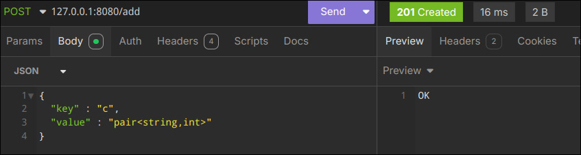
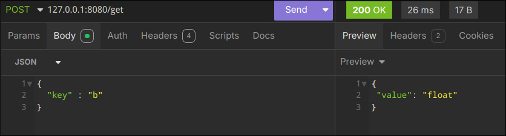
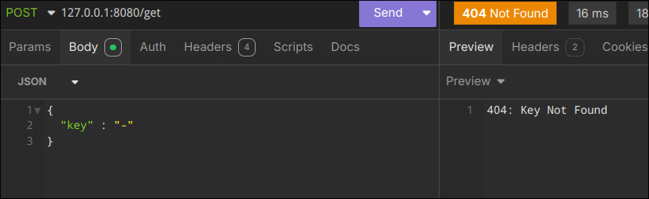
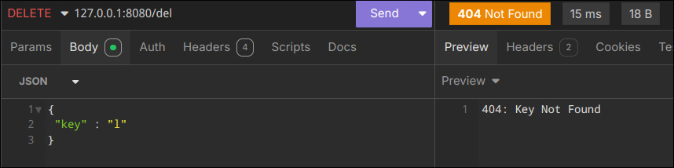
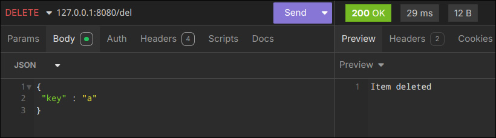
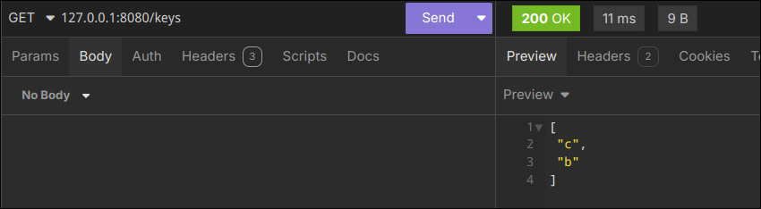
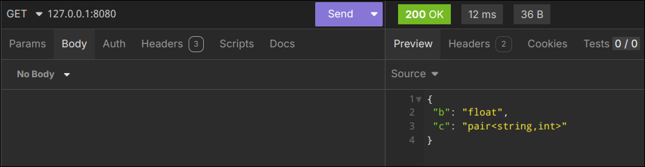
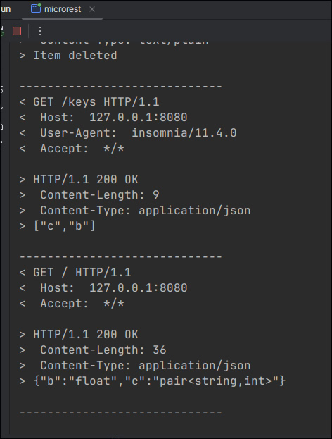

# KeyValue store

 Simple REST server that allows to use as in-memory key-value storage  
 But when server starts - storage is empty

 You can import routes for Insomnia [here](./assets/insomnia_microrest.yaml)

## Routes

 ### POST /add
 
 
 Add new key-value pair
 
### POST /get
 
 
 

 Return value by key
 
### DELETE /del

 Remove pair
 
### GET /keys

 Return array of keys, if no keys available return empty array
 
### GET /

Return all data in json format

### Server output

Server have simple but useful logging for requests and responses to debug